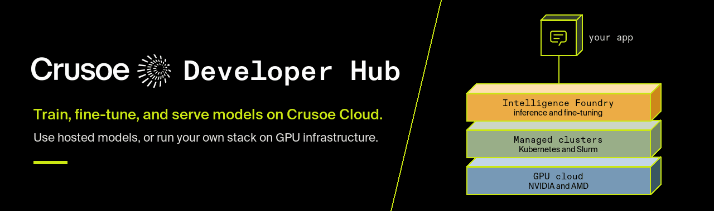
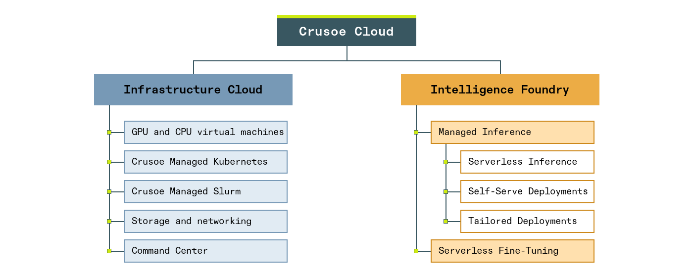

<div align="center">

<a href="https://www.crusoe.ai/developers">
  <picture>
    <source media="(prefers-reduced-motion: reduce)" srcset="assets/hub-banner.png">
    
  </picture>
</a>

[](https://www.linkedin.com/showcase/crusoedev/)
[](https://discord.gg/tRKs5bMyry)

<a href="https://www.crusoe.ai/developers"> Crusoe for Developers</a>&nbsp;&nbsp;|&nbsp;&nbsp;
<a href="https://docs.crusoecloud.com/"> Documentation</a>&nbsp;&nbsp;|&nbsp;&nbsp;
<a href="https://console.crusoecloud.com/"> Console</a>&nbsp;&nbsp;|&nbsp;&nbsp;
<a href="https://www.crusoe.ai/resources/blog?category=Engineering"> Engineering blog</a>

</div>

The Crusoe Developer Hub is the technical home for developers building AI applications and infrastructure on Crusoe Cloud. We publish three kinds of content here: foundational lessons that explain how things work, runnable examples that complete a task end to end, and integrations that connect Crusoe to the tools you already use. New projects land in their section without changing this page, so treat it as a map rather than a catalogue.

## Overview

Crusoe Cloud gives you everything needed to train, fine-tune, and serve models in one place, and lets you pick the level you want to work at. The offering has two families.

**[Infrastructure Cloud](https://www.crusoe.ai/cloud)** is the layer you operate yourself. Choose it when you want control of the cluster, the scheduler, and the serving stack.

- GPU and CPU virtual machines on NVIDIA and AMD hardware
- Crusoe Managed Kubernetes and Crusoe Managed Slurm for multi-node work
- Storage, networking, a container registry, and Command Center monitoring

**[Intelligence Foundry](https://www.crusoe.ai/cloud/managed-inference)** is the managed layer. Choose it when you want a model endpoint or a fine-tuned checkpoint without touching infrastructure.

- [Managed Inference](https://www.crusoe.ai/cloud/managed-inference) serves open-weight models behind an OpenAI-compatible API, as Serverless Inference, Self-Serve Deployments, or Tailored Deployments
- [Serverless Fine-Tuning](https://www.crusoe.ai/cloud/serverless-fine-tuning) customizes those models on your data and deploys the result with one click

<picture>
  <source media="(prefers-color-scheme: dark)" srcset="assets/product-line-dark.png">
  
</picture>

Most hub content sits on one branch or the other, and each section README says which. The tables below come from the [official documentation](https://docs.crusoecloud.com/), which stays authoritative as the platform changes.

### Models on Managed Inference

Crusoe Intelligence Foundry serves open-weight models behind `https://api.inference.crusoecloud.com/v1`. Any OpenAI-compatible SDK works; authenticate with an Intelligence API key from the Console. Three ways to consume it:

| <div align="center">Option</div> | <div align="center">When it fits</div> | <div align="center">Billing</div> |
| --- | --- | --- |
| [Serverless Inference](https://docs.crusoecloud.com/serverless-inference/overview) | Variable or unpredictable traffic, early development, no capacity to manage | Per input and output token, with published rate limits |
| [Self-Serve Deployments](https://docs.crusoecloud.com/self-serve-deployments/overview) | Sustained traffic that needs dedicated GPUs and predictable latency; profiles for responsiveness, throughput, or balanced | Per GPU-hour, replica count under your control |
| [Serverless Fine-Tuning](https://docs.crusoecloud.com/serverless-fine-tuning/overview) | LoRA-based supervised fine-tuning from a JSONL or Parquet dataset up to 3 GB, then deploy the checkpoint | Per training job, deployment as above |

Models available on Serverless Inference, as listed on the [available models page](https://docs.crusoecloud.com/serverless-inference/available-models) at the time of writing. Check that page for the current list and for models you can deploy or fine-tune.

<table>
  <thead>
    <tr>
      <th><div align="center">Provider</div></th>
      <th><div align="center">Model identifier</div></th>
      <th><div align="center">Type</div></th>
      <th><div align="center">Context</div></th>
    </tr>
  </thead>
  <tbody>
    <tr>
      <td rowspan="3"><div align="center"><br>DeepSeek</div></td>
      <td><code>deepseek-ai/DeepSeek-V4-Pro</code></td>
      <td><div align="center">Instruct</div></td>
      <td><div align="center">1M</div></td>
    </tr>
    <tr>
      <td><code>deepseek-ai/DeepSeek-V4-Flash</code></td>
      <td><div align="center">Instruct</div></td>
      <td><div align="center">1M</div></td>
    </tr>
    <tr>
      <td><code>deepseek-ai/DeepSeek-V3-0324</code></td>
      <td><div align="center">Instruct</div></td>
      <td><div align="center">160k</div></td>
    </tr>
    <tr>
      <td rowspan="1"><div align="center"><br>Google</div></td>
      <td><code>google/gemma-4-31b-it</code></td>
      <td><div align="center">Instruct</div></td>
      <td><div align="center">262k</div></td>
    </tr>
    <tr>
      <td rowspan="1"><div align="center"><br>Meta</div></td>
      <td><code>meta-llama/Llama-3.3-70B-Instruct</code></td>
      <td><div align="center">Instruct</div></td>
      <td><div align="center">128k</div></td>
    </tr>
    <tr>
      <td rowspan="1"><div align="center"><br>Moonshot AI</div></td>
      <td><code>moonshotai/Kimi-K2.6</code></td>
      <td><div align="center">Instruct</div></td>
      <td><div align="center">256k</div></td>
    </tr>
    <tr>
      <td rowspan="6"><div align="center"><br>NVIDIA</div></td>
      <td><code>nvidia/Nemotron-3-Ultra-550B</code></td>
      <td><div align="center">Instruct</div></td>
      <td><div align="center">262k</div></td>
    </tr>
    <tr>
      <td><code>nvidia/Nemotron-3-Super-120B-A12B</code></td>
      <td><div align="center">Instruct</div></td>
      <td><div align="center">262k</div></td>
    </tr>
    <tr>
      <td><code>nvidia/Nemotron-3-Nano-30B-A3B</code></td>
      <td><div align="center">Instruct</div></td>
      <td><div align="center">262k</div></td>
    </tr>
    <tr>
      <td><code>nvidia/Nemotron-3-Nano-Omni-Reasoning-30B-A3B</code></td>
      <td><div align="center">Instruct</div></td>
      <td><div align="center">262k</div></td>
    </tr>
    <tr>
      <td><code>nvidia/nemotron-3.5-lightning-30b-a3b</code></td>
      <td><div align="center">Instruct</div></td>
      <td><div align="center">1M</div></td>
    </tr>
    <tr>
      <td><code>nvidia/Nemotron-3-VoiceChat</code></td>
      <td><div align="center">Speech-to-speech</div></td>
      <td><div align="center">131k</div></td>
    </tr>
    <tr>
      <td rowspan="1"><div align="center"><br>OpenAI</div></td>
      <td><code>openai/gpt-oss-120b</code></td>
      <td><div align="center">Instruct</div></td>
      <td><div align="center">128k</div></td>
    </tr>
    <tr>
      <td rowspan="1"><div align="center"><br>Qwen</div></td>
      <td><code>qwen/Qwen3-235B-A22B-Instruct-2507</code></td>
      <td><div align="center">Instruct</div></td>
      <td><div align="center">131k</div></td>
    </tr>
    <tr>
      <td rowspan="4"><div align="center"><br>Z.ai</div></td>
      <td><code>zai/GLM-5.3</code></td>
      <td><div align="center">Instruct</div></td>
      <td><div align="center">1M</div></td>
    </tr>
    <tr>
      <td><code>zai/GLM-5.3-Flash</code></td>
      <td><div align="center">Instruct</div></td>
      <td><div align="center">1M</div></td>
    </tr>
    <tr>
      <td><code>zai/GLM-5.2</code></td>
      <td><div align="center">Instruct</div></td>
      <td><div align="center">256k</div></td>
    </tr>
    <tr>
      <td><code>zai/GLM-5.1</code></td>
      <td><div align="center">Instruct</div></td>
      <td><div align="center">202k</div></td>
    </tr>
  </tbody>
</table>

Provider marks belong to their respective owners.

### GPUs and CPUs

GPU virtual machines come as whole nodes with RDMA fabric for multi-node training, or as smaller PCIe slices for development and inference. Capacity is on demand, spot, or reserved. Instance names and per-zone availability are in the [VM documentation](https://docs.crusoecloud.com/compute/virtual-machines/overview/index.html).

<table>
  <thead>
    <tr>
      <th><div align="center">Vendor</div></th>
      <th><div align="center">Accelerator</div></th>
      <th><div align="center">GPUs per VM</div></th>
      <th><div align="center">Memory per GPU</div></th>
      <th><div align="center">Interconnect</div></th>
    </tr>
  </thead>
  <tbody>
    <tr>
      <td rowspan="7"><div align="center">NVIDIA</div></td>
      <td><div align="center">GB200 (Grace Blackwell)</div></td>
      <td><div align="center">4</div></td>
      <td><div align="center">186 GB</div></td>
      <td><div align="center">NVLink, 1600 Gbps InfiniBand</div></td>
    </tr>
    <tr>
      <td><div align="center">B300</div></td>
      <td><div align="center">8</div></td>
      <td><div align="center">288 GB</div></td>
      <td><div align="center">6400 Gbps InfiniBand</div></td>
    </tr>
    <tr>
      <td><div align="center">B200</div></td>
      <td><div align="center">8</div></td>
      <td><div align="center">180 GB</div></td>
      <td><div align="center">3200 Gbps InfiniBand</div></td>
    </tr>
    <tr>
      <td><div align="center">H200</div></td>
      <td><div align="center">8</div></td>
      <td><div align="center">141 GB</div></td>
      <td><div align="center">3200 Gbps InfiniBand</div></td>
    </tr>
    <tr>
      <td><div align="center">H100</div></td>
      <td><div align="center">8</div></td>
      <td><div align="center">80 GB</div></td>
      <td><div align="center">3200 Gbps InfiniBand</div></td>
    </tr>
    <tr>
      <td><div align="center">A100</div></td>
      <td><div align="center">1, 2, 4, or 8</div></td>
      <td><div align="center">80 GB</div></td>
      <td><div align="center">SXM with 1600 Gbps InfiniBand, or PCIe</div></td>
    </tr>
    <tr>
      <td><div align="center">L40S</div></td>
      <td><div align="center">1, 2, 4, 8, or 10</div></td>
      <td><div align="center">48 GB</div></td>
      <td><div align="center">PCIe</div></td>
    </tr>
    <tr>
      <td rowspan="2"><div align="center">AMD</div></td>
      <td><div align="center">MI355X</div></td>
      <td><div align="center">8</div></td>
      <td><div align="center">288 GB</div></td>
      <td><div align="center">3200 Gbps RDMA over Ethernet</div></td>
    </tr>
    <tr>
      <td><div align="center">MI300X</div></td>
      <td><div align="center">8</div></td>
      <td><div align="center">192 GB</div></td>
      <td><div align="center">3200 Gbps InfiniBand</div></td>
    </tr>
  </tbody>
</table>

CPU-only VMs cover the rest of a workload: general-purpose `c1a` and `c2a` families from 2 to 176 vCPUs on AMD EPYC, and storage-optimized `s1a` and `s2a` families with local NVMe from roughly 13 TB to 123 TB per VM.

### Clusters, storage, and networking

| <div align="center">Component</div> | <div align="center">What it gives you</div> |
| --- | --- |
| Crusoe Managed Kubernetes | A Kubernetes control plane with GPU drivers, network operators, and storage add-ons preconfigured, plus automatic node remediation through AutoClusters |
| Crusoe Managed Slurm | The familiar `sbatch`, `srun`, `squeue`, and `sinfo` workflow with topology-aware scheduling, running on a Crusoe-managed control plane with the same GPUs and InfiniBand |
| Storage and networking | Persistent and shared disks, S3-compatible object storage co-located with compute, a container registry, VPC networks with firewall rules and load balancers, InfiniBand and NVLink fabrics |
| Tooling | [Console](https://console.crusoecloud.com/), [CLI](https://docs.crusoecloud.com/installing-the-cli), [Terraform provider](https://docs.crusoecloud.com/infrastructure-cloud/terraform), versioned REST APIs for the cloud and for Managed AI, an [MCP server](https://docs.crusoecloud.com/reference/mcp-server), and Command Center for topology, health, metrics, and logs |

The [GPU cluster quickstart](https://docs.crusoecloud.com/quickstart/spin-up-gpu-cluster) walks through both orchestration paths.

## Explore the hub

The repository is organized by what you are trying to do, not by product. Four top-level directories hold the content, and each has a README that lists its current entries with their prerequisites.

- [`foundations/`](foundations/) explains the mechanics: GPU kernels in Triton, quantization, LoRA and QLoRA, and, as the tracks grow, RAG, agents, and cloud concepts such as storage and Slurm. Lessons are notebooks and short scripts you can run and modify.
- [`examples/`](examples/) completes a task end to end: provision infrastructure, prepare data and fine-tune a model, serve and call models, follow a workshop, or apply a cookbook recipe. Each example states its prerequisites, expected output, and cleanup steps.
- [`integrations/`](integrations/) connects Crusoe to a tool you already use: LangChain, LiteLLM, MLflow, Google ADK, Postman, Hugging Face Spaces, Cursor, Zed, Tavily, and Linkup. Each directory holds the package, configuration, or recipe for that tool.
- [`solutions-library/`](solutions-library/) points to workflows that combine several components: GPU clusters with NCCL tests, shared storage drivers, Slurm images, KServe serving, TorchTitan pretraining on Kubernetes, and Grafana monitoring.

The same subject can appear in more than one place in a different form. Fine-tuning, for example, is a lesson in [`foundations/`](foundations/), a runnable task in [`examples/`](examples/), and a cluster workflow in [`solutions-library/`](solutions-library/). Start from the directory that matches the outcome you want, then read its README before installing anything. The animation below is the same map: pick the goal on the left and follow it to the directory and subdirectories on the right.

<picture>
  <source media="(prefers-reduced-motion: reduce) and (prefers-color-scheme: dark)" srcset="assets/repo-overview-dark.png">
  <source media="(prefers-reduced-motion: reduce)" srcset="assets/repo-overview.png">
  <source media="(prefers-color-scheme: dark)" srcset="assets/repo-overview-dark.gif">
  
</picture>

## Getting started

### Your first API call

1. Open the [Crusoe Console](https://console.crusoecloud.com/). Under **Admin > Security > Intelligence API keys**, create a key and save it securely. See the [official API-key instructions](https://docs.crusoecloud.com/serverless-inference/index.html#2-generate-an-api-key).
2. In your Python environment, install the client and set your key:

   ```bash
   python -m pip install openai
   export CRUSOE_API_KEY="your-api-key"
   ```

3. Send a request with any OpenAI-compatible client:

   ```python
   import os
   from openai import OpenAI

   client = OpenAI(
       api_key=os.environ["CRUSOE_API_KEY"],
       base_url="https://api.inference.crusoecloud.com/v1",
   )

   response = client.chat.completions.create(
       model="meta-llama/Llama-3.3-70B-Instruct",
       messages=[{"role": "user", "content": "Explain GPU inference in one paragraph."}],
   )
   print(response.choices[0].message.content)
   ```

You should see the model's text response. This follows the [official Serverless Inference quickstart](https://docs.crusoecloud.com/serverless-inference/index.html); pick any model from the table above. Inference requests can incur usage charges.

### Clone the repository

```bash
git clone https://github.com/crusoecloud/crusoe-developer-hub.git
cd crusoe-developer-hub
```

Then follow along with the README in the directory you chose.

### Provision infrastructure

1. **Install and configure the CLI:** Follow the [CLI installation guide](https://docs.crusoecloud.com/installing-the-cli), then authenticate with the credentials from your Console account.
2. **Start with a single VM:** The [VM quickstart](https://docs.crusoecloud.com/quickstart/creating-a-vm) walks through choosing an instance type, an image, and an SSH key, and connecting to the machine.
3. **Scale to a cluster:** The [GPU cluster quickstart](https://docs.crusoecloud.com/quickstart/spin-up-gpu-cluster) covers multi-node setups on Crusoe Managed Kubernetes or Crusoe Managed Slurm, with InfiniBand and the GPU operators preconfigured.
4. **Automate it:** Use the [Terraform provider](https://docs.crusoecloud.com/infrastructure-cloud/terraform) or the REST API once the manual path is familiar.

Compute, storage, and deployed endpoints incur charges while they exist. Delete resources you no longer need from the Console or the CLI; closing a notebook or terminal does not remove them.

## License

This project is licensed under the MIT License. See the [LICENSE](LICENSE) file for details.
