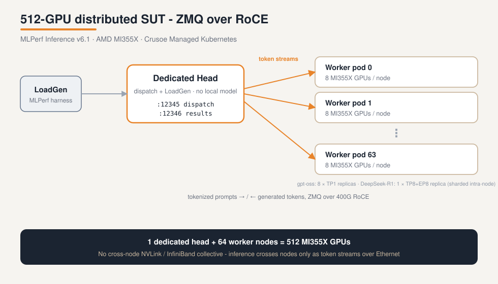

# MLPerf Inference v6.1 on AMD MI355X - Kubernetes-native reproduction

Reproduce Crusoe's **MLPerf Inference v6.1** submissions for **gpt-oss-120b** and **DeepSeek-R1**
at **512-GPU (64-node) scale** on AMD Instinct MI355X, running on **Crusoe Managed Kubernetes (CMK)**.

MLPerf's reference harnesses are designed to run as Docker containers on bare metal or a single VM.
Because most large-scale inference on Crusoe runs on Kubernetes, we re-expressed the benchmark as a set
of **Kubernetes-native manifests + launchers** - so the same run scales from 1 node to 64 nodes with
`kubectl`, gets streamlined observability, and is fault-tolerant. This repo is that orchestration layer,
published so anyone with a CMK cluster can reproduce the runs step for step.

> Companion blog post: *Serving 5.75 million tokens per second: Crusoe's MLPerf Inference v6.1 results on AMD MI355X* (Crusoe). These were, at submission, the
> largest gpt-oss-120b and DeepSeek-R1 MLPerf Inference results recorded.

## What you should reproduce (headline numbers, 512 GPU, closed division)

| Model | Scenario | Throughput | Accuracy gate | Compliance |
|---|---|---|---|---|
| gpt-oss-120b | Offline | ~5.75M tok/s | exact_match ≥ 82.30 (got ~83.7) | TEST07 + TEST09 |
| gpt-oss-120b | Server | ~5.39M tok/s (@ target_qps 4000) | same | TEST07 + TEST09 |
| DeepSeek-R1 | Offline | ~2.90M tok/s | exact_match ≥ 80.5446 + tokens/sample ∈ [3497.6, 4274.85] | TEST06 |
| DeepSeek-R1 | Server | ~2.40M tok/s (warmup-enabled) | same | TEST06 |

The official `submission_checker` should report `SUMMARY: submission looks OK`.

## The architecture



A **distributed ZMQ SUT** (system-under-test): **1 dedicated head** pod dispatches work and runs LoadGen;
**64 worker** pods each own a node's **8 MI355X GPUs**. How those 8 GPUs are used differs by model:

- **gpt-oss-120b** fits in a single GPU at MXFP4, so each node runs **8 independent single-GPU replicas
  (tensor-parallel size 1)** - 512 replicas total.
- **DeepSeek-R1** is a 671B-parameter MoE that does not fit in one GPU, so each node runs **one replica
  sharded across all 8 GPUs** (tensor-parallel 8 + expert-parallel 8 + DP-attention 8) - 64 replicas total.

In both cases the sharding is **intra-node over XGMI**; work crosses *nodes* only as **tokenized input/output
streams over the RoCE (Ethernet) fabric** - there is *no* cross-node NVLink/InfiniBand collective. The
`launch-mn*.sh` scripts pick a free MI355X node for the head, template the head IP into the manifests, and
launch the worker `Job` with `parallelism=64`. `device_count = 8*N` counts GPUs either way (512 at 64 nodes).

## Repository layout

```
k8s/
  common/         00-namespace.yaml, 01-pvc.yaml         # namespace + shared RWX PVC
  gpt-oss/        download jobs, head/worker manifests, launchers, accuracy/compliance, package
    patches/      harden-*.py                            # our ZMQ registration-hardening for 512-GPU
  deepseek-r1/    download jobs, head/worker manifests, launcher, offline+server(warmup)+TEST06, package
    build/        kaniko build wrappers (consume AMD's public v6.1 harness - see below)
    patches/      harden-*.py + enable-deepseek-warmup.py  # our warmup fix (Server-VALID breakthrough)
    submission/   packaging manifest
docs/
  methodology.md  the K8s-native approach in depth
```

## Prerequisites

1. **A Crusoe Cloud account** with access to **MI355X (288GB)** capacity, and a **Crusoe Managed Kubernetes**
   cluster with ≥ 65 MI355X nodes for the full 512-GPU run (the flow scales down - see *Running at smaller scale*).
   Nodes carry the label `crusoe.ai/accelerator=amd-mi355x-288gb-roce`.
2. **`kubectl`** (configured for your CMK cluster) and **`helm`**.
3. A **container registry** you can push to (e.g. Crusoe Container Registry) and an image-pull secret in the
   cluster named `regcred` (rename throughout if you prefer).
4. A **Hugging Face token** with accepted licenses / access for the model repos:
   - gpt-oss: `openai/gpt-oss-120b` (native MXFP4)
   - DeepSeek-R1: `amd/Deepseek-S3_sq_a05_v2_mlperf6_1` (gated - request access first)
   - (llama models if you extend this)
5. **MLCommons datasets** - the gpt-oss and DeepSeek eval/calibration datasets are pulled from the public
   MLCommons R2 downloader via `mlcr`/`mlc-r2-downloader` (no token). Some MLPerf datasets require agreeing to
   a license; follow the prompts in the download jobs.
6. The **container images** are built from **AMD's published MLPerf v6.1 submission code** - see below.

### Placeholders you must set

This repo is de-identified. Before running, substitute your own values:

| Placeholder | Meaning |
|---|---|
| `<your-registry>/<your-project>` | your container registry + project/namespace |
| `regcred` | your image-pull secret name |
| `hf-token` (k8s secret) | holds your Hugging Face token under key `token` |

```bash
# one-shot registry substitution across the manifests:
grep -rl '<your-registry>/<your-project>' k8s | xargs sed -i '' 's#<your-registry>/<your-project>#YOUR.REGISTRY/YOURPROJECT#g'   # macOS
```

## Containers - build from AMD's public v6.1 code

The actual inference harnesses (vLLM for gpt-oss, SGLang for DeepSeek) are **AMD's MLPerf v6.1 submission
code**, published by MLCommons at `mlcommons/submissions_inference_v6.1/closed/AMD/`. We do **not** redistribute
AMD's harness here. To build the images:

1. Clone the published MLPerf v6.1 submission repo and locate `closed/AMD/` (code, Dockerfiles, patches).
2. Use AMD's public base images (e.g. `rocm/sgl-dev:…` for DeepSeek, `rocm/amd-mlperf:…` for gpt-oss).
3. Build and push to **your** registry. `k8s/deepseek-r1/build/` contains our **kaniko build wrappers**
   (`build-image.sh`, `02-ds-build-stage1.yaml`, `03-ds-build-stage2.yaml`) that build in-cluster (no Docker
   daemon / raw VM needed) and push using your `regcred` secret - point their build context at AMD's code.

## Reproduce - gpt-oss-120b

```bash
kubectl apply -f k8s/common/00-namespace.yaml -f k8s/common/01-pvc.yaml
kubectl -n mlperf create secret generic hf-token --from-literal=token=<HF_TOKEN>

kubectl apply -f k8s/gpt-oss/20-download-job.yaml            # model -> /shared/models/gpt-oss-120b*
kubectl apply -f k8s/gpt-oss/23-download-gptoss-dataset-job.yaml   # dataset (MLCommons R2)

# stage our ZMQ-hardening patches onto the shared PVC (head/worker pods auto-apply them at start):
kubectl apply -f k8s/common/02-stage-pod.yaml
kubectl -n mlperf exec stage -- mkdir -p /shared/patches
for f in k8s/gpt-oss/patches/*.py; do kubectl -n mlperf cp "$f" mlperf/stage:/shared/patches/$(basename "$f"); done

cd k8s/gpt-oss
DEDICATED_HEAD=1 bash launch-mn-offline.sh 64                # Offline  -> ~5.75M tok/s
DEDICATED_HEAD=1 bash launch-mn.sh 64 "" 4000               # Server   -> ~5.39M tok/s (target_qps MUST be 4000)
DEDICATED_HEAD=1 DEVICE_COUNT=496 bash mn-accuracy-offline-64.sh    # accuracy (~83.7); 496 = 512 minus a 2-node tolerance (see note below)
DEVICE_COUNT=496 bash mn-compliance-64.sh TEST07 && DEVICE_COUNT=496 bash mn-compliance-64.sh TEST09
kubectl apply -f 105-v61-gptoss-512-package.yaml            # assemble tree + run submission_checker
```

> **Why `DEVICE_COUNT=496` for accuracy and compliance?** The head waits for `DEVICE_COUNT` GPU replicas to
> register before it starts the run. Performance runs require the full **512** (a throughput number must
> reflect every GPU). Accuracy and compliance are **scale-independent** - each sample is issued and scored
> exactly once, so 496 replicas produce the same result as 512. Setting the barrier to **496** (= 512 - 16,
> a 2-node tolerance) lets the run start even if one or two replicas hit the rare vLLM engine-startup flake,
> instead of forcing a relaunch just to get a number that would be identical anyway.

## Reproduce - DeepSeek-R1

```bash
cd k8s/deepseek-r1
kubectl apply -f 19-ds-token-check.yaml     # confirm your HF token is approved for the gated repo
kubectl apply -f 00-ds-download-model.yaml   # ~366 GB -> /shared/models/deepseek-r1/S3_sq_a05_v2
kubectl apply -f 01-ds-download-dataset.yaml # MLCommons R2 eval dataset

# stage patches to /shared/patches-ds/ (note the -ds suffix). See patches/README.md for the full list.
kubectl apply -f ../common/02-stage-pod.yaml
kubectl -n mlperf exec stage -- mkdir -p /shared/patches-ds
for f in patches/*.py; do kubectl -n mlperf cp "$f" mlperf/stage:/shared/patches-ds/$(basename "$f"); done
# NOTE: the SERVER (warmup) path ALSO needs two config overlays derived from AMD's DeepSeek config -
#   /shared/patches-ds/server_mn_warmup.yaml and /shared/patches-ds/user_mi355x_mn_warmup.conf.
#   Offline does not. See patches/README.md for how to create them.

DEDICATED_HEAD=1 SCENARIO=offline bash launch-mn-deepseek.sh 64                 # Offline -> ~2.90M tok/s
DEDICATED_HEAD=1 SCENARIO=server WARMUP=1 bash launch-mn-deepseek.sh 64         # Server  -> ~2.40M tok/s
MODE=accuracy DEDICATED_HEAD=1 SCENARIO=offline bash launch-mn-deepseek.sh 64   # accuracy (~80.7, gate 80.5446)
DEDICATED_HEAD=1 SCENARIO=offline TEST06=1 bash launch-mn-deepseek.sh 64          # TEST06 compliance (Offline)
DEDICATED_HEAD=1 SCENARIO=server WARMUP=1 TEST06=1 bash launch-mn-deepseek.sh 64  # TEST06 compliance (Server)
kubectl apply -f submission/package-64node-full.yaml       # assemble + submission_checker
```

## Why the two "fixes" in `patches/` matter

- **`harden-*.py` (both models):** at 512 GPUs, 512 workers register with the head over ZMQ within seconds.
  The stock SUT drops registrations under that burst; our patches add `ROUTER_HANDOVER`, larger backlogs,
  a dedup + poll-timeout registration loop, and worker-side REGISTER retry so all 512 replicas attach reliably.
- **`enable-deepseek-warmup.py` (DeepSeek):** the stock harness's warmup self-disabled for DeepSeek, so the
  first server queries paid full cold-start latency and blew the p99 TTFT limit. Adding a `deepseek-r1` entry to
  the warmup sample map collapses p99 TTFT from ~130 s to ~1.7 s - this is what makes the Server run VALID.

## Running at smaller scale

Every launcher takes the node count as its argument: `bash launch-mn-offline.sh <N>` runs on `N` worker nodes
(`device_count = 8*N`). Try `N=1` (8 GPUs, single node) or `N=8` (64 GPUs) first to validate the pipeline before
the full `N=64`. Accuracy is scale-independent, so you can validate correctness cheaply at small `N`.

## Verify a valid reproduction

The package manifests run the official MLCommons `submission_checker` (v6.1) over the assembled result tree.
A clean run ends with `Closed Results=2 … SUMMARY: submission looks OK`.

## Notes & caveats

- The worker/head pods use `hostNetwork: true` and `privileged: true` (required for the ZMQ multi-node SUT and
  GPU/RDMA access). Review against your cluster's security posture before applying.
- `108/109` (DeepSeek offline TEST06) hardcode `device_count=512`/`target_qps=760` for the 64-node config;
  adjust for other scales.
- The `submitter`/system-name strings in the packaging manifests are Crusoe's; change them to your own for a
  real submission.

## Attribution & license

- Inference harnesses, quantized models, and Dockerfiles are **AMD's** MLPerf v6.1 work
  (`mlcommons/submissions_inference_v6.1/closed/AMD`). Datasets and the `submission_checker` are **MLCommons'**
  (`mlcommons/inference`). This repo contributes the **Kubernetes orchestration + scaling patches** only.
- Licensed under **Apache-2.0** - see [LICENSE](LICENSE).
