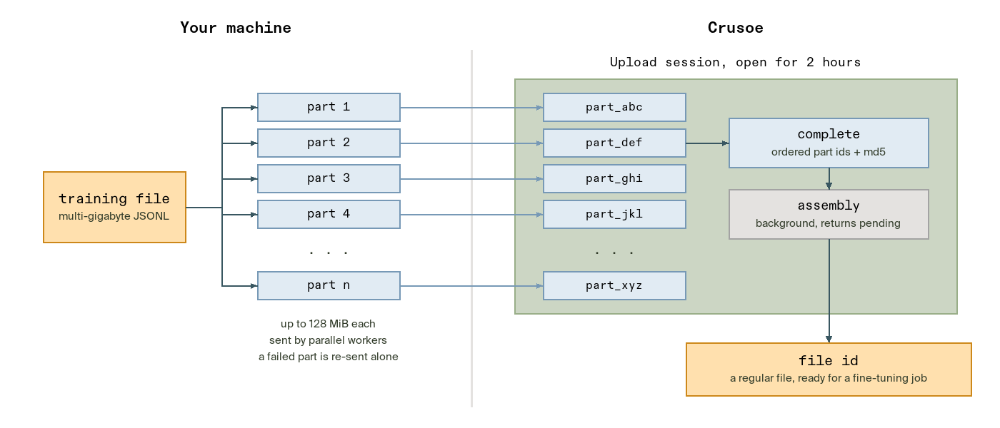

# Upload a large fine-tuning dataset in parts

Upload a multi-gigabyte training file to Crusoe with the multipart path in the OpenAI-compatible Uploads API, then hand the assembled file to a fine-tuning job. The [notebook](multipart-upload.ipynb) is the companion to the blog post *Making Room for Bigger Fine-Tuning Datasets*. It walks through the four steps with a public chat dataset: create the upload, send the parts in parallel, complete with a checksum, and poll until Crusoe returns a ready-to-use file id.

<div align="center"></div>

This example is about the API. For a full fine-tune, deploy, and evaluate walkthrough, see [PII redaction](../pii-redaction/).

## Prerequisites

- A Crusoe Inference API key, created in [Inference API keys](https://console.crusoecloud.com/security/inference-api-keys). The optional last step submits a fine-tuning job and needs access to Serverless Fine-Tuning.
- A Hugging Face token, created in [Access Tokens](https://huggingface.co/settings/tokens), for the dataset download.
- Python 3.12 and a Jupyter client such as VS Code or JupyterLab. No GPU is involved.

## How to get started

Clone the repository, create an environment for this example, and install its three dependencies:

```bash
git clone https://github.com/crusoecloud/crusoe-developer-hub.git
cd crusoe-developer-hub/examples/training/multipart-dataset-upload

python3.12 -m venv .venv && source .venv/bin/activate
python -m pip install -r requirements.txt
```

Then open [multipart-upload.ipynb](multipart-upload.ipynb), select the `.venv` interpreter as the kernel, paste your tokens into `CRUSOE_API_KEY` and `HF_TOKEN` in the setup cell, and run the cells in order. The notebook builds a large training file from a public dataset first, so the prerequisite cell takes a few minutes; set `MAX_ROWS` to an integer there for a quicker trial. Helpers for the dataset export, part reading, parallel sends, and polling live in [utils.py](utils.py) next to the notebook.

The assembled file persists in your account until you delete it. Set `DELETE_UPLOADED_FILE = True` in the last cell when you are done, and leave `SUBMIT_FINE_TUNING_JOB = False` unless you intend to pay for a training run over 208,000 conversations.

## References

- [Uploads API reference](https://docs.crusoecloud.com/api/managed-ai/#tag/Uploads) and [Fine-tuning API reference](https://docs.crusoecloud.com/api/managed-ai/#tag/Fine-tuning)
- [Serverless Fine-Tuning documentation](https://docs.crusoecloud.com/serverless-fine-tuning/overview)
- [OpenAI Uploads API reference](https://platform.openai.com/docs/api-reference/uploads), the shape Crusoe's API matches
