# GPU Programming with Triton

A hands-on introduction to GPU programming using [Triton](https://triton-lang.org/), the Python-embedded language and compiler for writing GPU kernels. The track starts with how a GPU executes code and how its memory is organized, because every performance decision in a kernel comes back to those two things. It then walks through a short lesson in CUDA C++ terms followed by five Triton kernels of increasing subtlety, each as a set of short programs you can run, benchmark, and modify on any NVIDIA GPU.

You need to be comfortable with Python and PyTorch tensors. No CUDA experience is assumed. Every script is self-contained and checks its own result against PyTorch before it reports anything.

Lesson 00 introduces the GPU in CUDA C++ terms with three short programs, and lesson 01 carries a CUDA C++ version of the Triton kernel under `01_vector_add/cuda/`. These are reference material for comparison; the track itself is written in Triton, and the C++ files are optional to build.

## Setup

Requires [`uv`](https://docs.astral.sh/uv/) and an NVIDIA GPU with a working CUDA driver. The scripts select `cuda:0`. No Crusoe API key is required. If you use a cloud GPU, its compute and storage incur charges while they exist.

```bash
# from this directory
uv venv .venv --python 3.12
uv pip install -r requirements.txt --python .venv/bin/python
```

The pinned versions in `requirements.txt` are the ones the reference numbers in Part 4 were produced with: PyTorch 2.6.0 and Triton 3.2.0.

The CUDA C++ programs need the CUDA toolkit for `nvcc`; the driver alone is not enough. On Ubuntu 24.04 the toolkit installs from NVIDIA's package repository without touching the driver:

```bash
wget https://developer.download.nvidia.com/compute/cuda/repos/ubuntu2404/x86_64/cuda-keyring_1.1-1_all.deb
sudo dpkg -i cuda-keyring_1.1-1_all.deb
sudo apt-get update && sudo apt-get install -y cuda-toolkit-12-8
export PATH=/usr/local/cuda/bin:$PATH
```

Each `cuda/` directory has a `Makefile`; `make` builds its programs with `-arch=native` for the GPU in the machine.

## Running a script

```bash
.venv/bin/python 01_vector_add/v0_basic.py
```

Each script prints the GPU it found and `OK` for every size that passes its correctness check. Benchmark scripts print a table and write a plot and CSV to a `results/` directory next to the script. Your numbers will differ from the reference tables with GPU model, driver, and clock state; the shape of the curves should not.

### Jupyter or VS Code

Register the environment as a kernel and select **gpu-programming (.venv)** from the kernel picker:

```bash
uv pip install ipykernel --python .venv/bin/python
.venv/bin/python -m ipykernel install --user --name=gpu-programming --display-name="gpu-programming (.venv)"
```

## Part 1: How a GPU runs your code

### CPUs and GPUs are built for different jobs

A CPU is a latency-optimized machine. It has a handful of powerful cores, and most of its silicon goes to making a single thread finish as fast as possible: large caches keep recently used data close, and control logic handles branch prediction, speculative execution, and out-of-order scheduling. A GPU is a throughput-optimized machine. It has thousands of simple arithmetic units, small caches, and simple control logic. Any one GPU thread is slower than a CPU thread, but the aggregate work completed per second is orders of magnitude higher because thousands of threads run at once.

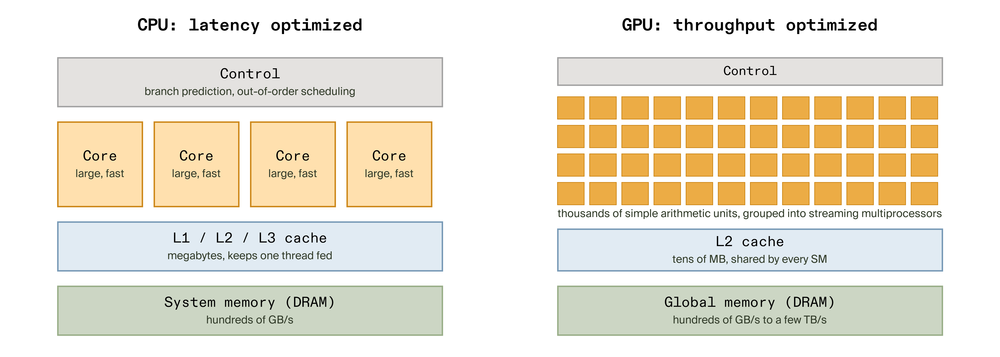

This is why GPUs suit deep learning. Element-wise operations, matrix multiplications, convolutions, and attention all apply the same arithmetic to many independent pieces of data. Work with that shape is called embarrassingly parallel: each output depends on a small, fixed set of inputs and nothing else, so it can be spread across every arithmetic unit on the chip without coordination.

### Host and device

CUDA vocabulary calls the CPU the host and the GPU the device. They have separate memory. The host allocates device memory, copies inputs across the PCIe bus, launches a kernel, and copies results back or leaves them on the device for the next kernel. When you call `x.to("cuda")` in PyTorch, that is the copy. When you call `x + y` on two CUDA tensors, PyTorch launches a kernel and returns immediately while the GPU works; the two processors run on their own clocks and only synchronize when you ask them to. Every Triton kernel in this track is launched from the host and runs on the device, and the benchmarking section below explains why that asynchrony matters when you time anything.

### Threads, warps, blocks, and grids

A kernel is a function that the host launches to run on the device across many instances in parallel. The hardware organizes those instances in a hierarchy.

- A **thread** is one instruction stream working on one piece of data.
- A **warp** is a group of 32 threads that the hardware schedules together, issuing one instruction to all of them at a time.
- A **block** is a group of threads that run on the same streaming multiprocessor and can share fast on-chip memory. In Triton, a block is what one program instance owns, and the words block and tile are used interchangeably.
- The **grid** is every block launched by one kernel call. It is a logical structure that tells the GPU how much work exists; the GPU's scheduler hands blocks to streaming multiprocessors as they free up until the grid is complete.

<picture>
  <source media="(prefers-reduced-motion: reduce)" srcset="assets/thread-hierarchy.png">
  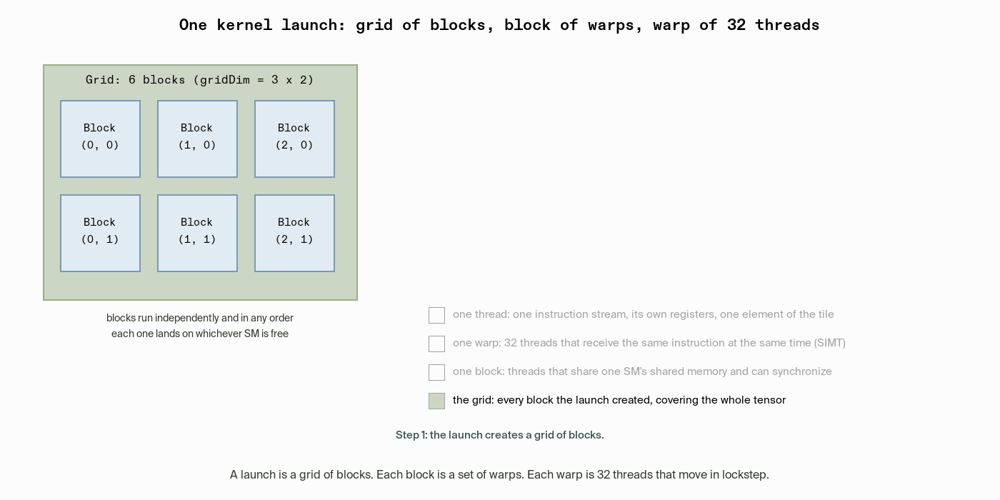
</picture>

The picture to hold in mind: a launch creates a grid of blocks, each block is a stack of warps, and each warp is 32 threads that move in lockstep. A block of 256 threads is 8 warps. With 1,000,000 elements and 256 threads per block, the grid is 3,907 blocks, and the GPU works through them as SMs free up. In CUDA you name every level of this hierarchy with `threadIdx`, `blockIdx`, and `blockDim`; in Triton you name only the block through `tl.program_id`, and `BLOCK_SIZE` fixes how many elements it covers.

NVIDIA calls this execution style [SIMT, single instruction, multiple threads](https://docs.nvidia.com/cuda/cuda-c-programming-guide/index.html#simt-architecture): a warp executes one common instruction at a time, and full efficiency comes when all 32 threads agree on their execution path. The programming guide's description of [thread and block hierarchy](https://docs.nvidia.com/cuda/cuda-c-programming-guide/index.html#thread-hierarchy) is the primary source for the terms used here.

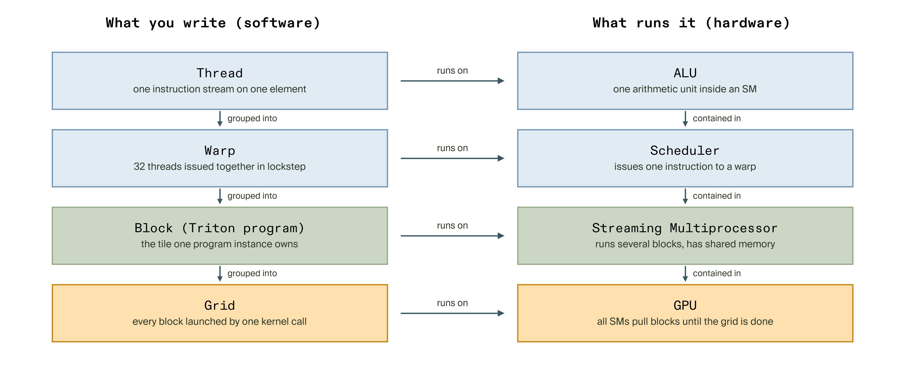

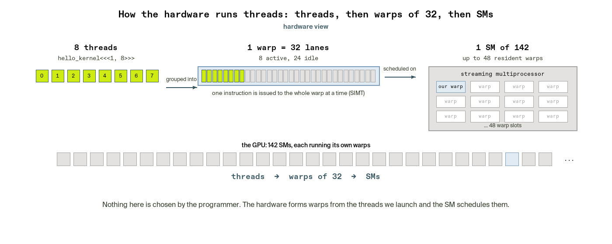

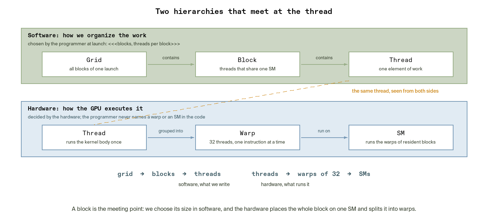

A **streaming multiprocessor (SM)** is the hardware unit that executes blocks. It holds arithmetic units, a register file, and a slice of shared memory, and it can run several blocks at once if their register and shared-memory needs fit. An NVIDIA L40S has 142 SMs; an H100 has 132. When you launch a grid of a thousand blocks, the SMs run the first few hundred immediately and pull the rest from the grid as they finish.

<picture>
  <source media="(prefers-reduced-motion: reduce)" srcset="assets/blocks-to-sms.png">
  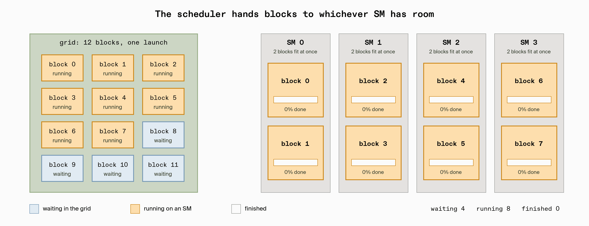
</picture>

### Triton programs blocks, not threads

In CUDA you write code from the point of view of one thread and reason explicitly about how thousands of them interleave, share memory, and synchronize. In Triton you write code from the point of view of one block. A single program instance loads a whole tile of a tensor, computes on it with vector operations, and stores the tile back. The compiler decides how the threads inside that block divide the work, how memory accesses are laid out so they coalesce, and when to use shared memory.


This is the single most important shift when learning Triton. You choose the tile size and the number of tiles; the compiler handles the thread-level mechanics. Threads and warps still exist underneath, and they still explain the GPU's behavior, which is why the divergence lesson in [`04_masking_where`](./04_masking_where/) matters even though you never name a warp in the code.

## Part 2: The memory hierarchy

### Five levels, three orders of magnitude apart

Arithmetic units can only work on data that has reached them, and getting data there is the expensive part. GPU memory is organized as a hierarchy where each level is larger and slower than the one above it. The [CUDA programming guide's memory hierarchy](https://docs.nvidia.com/cuda/cuda-c-programming-guide/index.html#memory-hierarchy) defines the levels; the numbers below come from published measurements of Hopper-generation hardware.

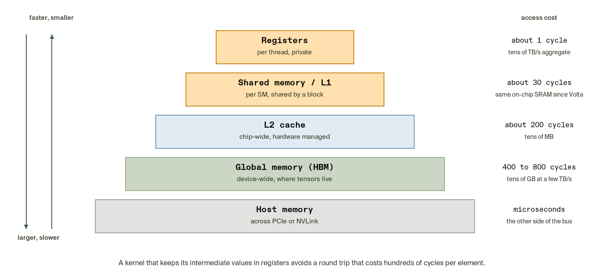

| Level | Scope | Access latency on Hopper GPUs | Managed by |
| --- | --- | --- | --- |
| Registers | Private to one thread | About 1 cycle | Compiler |
| Shared memory and L1 cache | One block on one SM | Roughly 30 to 40 cycles | Shared memory by the program, L1 by hardware |
| L2 cache | Whole chip | Roughly 260 to 740 cycles depending on partition and hit | Hardware |
| Global memory (HBM) | Whole device | Roughly 480 to 660 cycles | Program |
| Host memory | Across PCIe or NVLink | Microseconds | Program |

The latency figures are measured values for Hopper-generation hardware; other generations differ in detail but not in shape. Registers are where arithmetic happens: when a kernel adds two values, the operands come from registers and the result goes back to registers. Shared memory and L1 are the same physical on-chip SRAM on NVIDIA GPUs since Volta, partitioned between explicit program-managed storage and hardware-managed cache. L2 sits between the SMs and DRAM and buffers every global memory transaction. Global memory is the gigabytes of high-bandwidth DRAM where your tensors live. It offers terabytes per second of bandwidth but hundreds of cycles of latency for any single access.

### Latency hiding and occupancy

A GPU does not try to make each memory access fast. It accepts that each one is slow and keeps thousands of threads in flight, so that while some wait for data, others compute.

<picture>
  <source media="(prefers-reduced-motion: reduce)" srcset="assets/latency-hiding.png">
  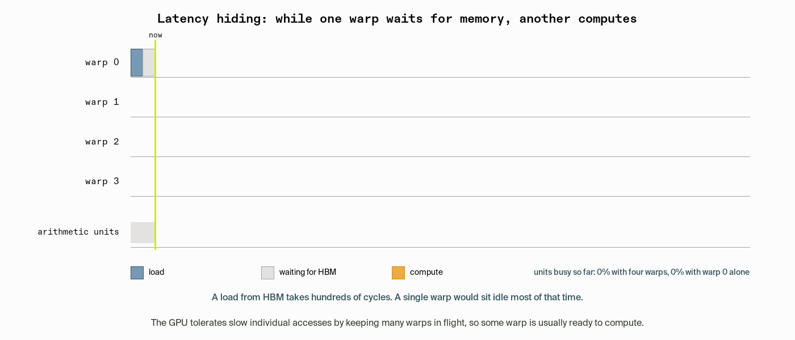
</picture> By the time the scheduler cycles back to the first warp, its data has usually arrived. This only works if enough warps are resident on each SM, which is what occupancy measures: the fraction of the SM's warp slots that are in use. Register and shared-memory usage per block set the ceiling, and the [CUDA best practices guide](https://docs.nvidia.com/cuda/cuda-c-best-practices-guide/index.html#occupancy) covers how to reason about it. Triton allocates registers for you, but the effect is still visible: a fused kernel that keeps many intermediate values alive uses more registers per thread, and past a threshold that lowers occupancy and can slow the kernel down.

### Memory-bound and compute-bound kernels

Arithmetic intensity is the ratio of floating-point operations to bytes moved from global memory. An H100 can perform roughly 590 FLOPs in the time it takes to fetch one byte from HBM at peak rates. A kernel that does far fewer operations per byte spends its time waiting on memory and is memory-bound; a kernel that does far more is compute-bound. Vector addition does one operation per twelve bytes. SiLU does about five operations per eight bytes. Every kernel in this track is deeply memory-bound, which has two consequences for how the lessons are written:

- Throughput is reported in GB/s, not FLOP/s, because bytes moved is the quantity the hardware is actually limited by.
- The way to make these kernels faster is to move fewer bytes, not to do less arithmetic. Fusion in `03_swiglu_fusion` is the direct application of that rule.

A memory-bound kernel's ceiling is the GPU's memory bandwidth. The L40S used for the reference numbers below has 864 GB/s; the vector-add kernel reaches about 630 GB/s at 16 million elements, or roughly 73 percent of peak, and PyTorch's own kernel lands in the same place because both are limited by the same DRAM.

## Part 3: Triton

### Where Triton sits

GPU programming tools form a spectrum. At one end, PyTorch and JAX give you complete models in a few lines and hide the hardware entirely. At the other end, CUDA C++ and PTX give you every register and every byte of shared memory, at the cost of hundreds of lines for even a simple operation. Triton sits between them: a Python function decorated with `@triton.jit`, operating on tiles, compiled by a dedicated compiler into the same kind of GPU binary that CUDA produces. It is already part of the mainstream stack. PyTorch 2's `torch.compile` generates Triton kernels through TorchInductor, and inference engines such as vLLM and SGLang ship Triton attention kernels so that one implementation runs on NVIDIA, AMD, and Intel hardware. When `torch.compile` cannot invent the kernel you need, a custom activation, an unusual normalization, or a fused operation, Triton is how you write it without leaving Python.

Triton is unrelated to NVIDIA Triton Inference Server, a model-serving platform that shares only the name.

### From Python to GPU binary

The `@triton.jit` decorator does not compile anything when the module is imported. The first call to the kernel triggers compilation: Triton parses the Python function into an abstract syntax tree, lowers it into its own hardware-agnostic intermediate representation (TTIR), then into a GPU-aware representation (TTGIR) where tiles are mapped onto warps and memory layouts are chosen, then into LLVM IR, then into [PTX](https://docs.nvidia.com/cuda/parallel-thread-execution/), NVIDIA's virtual instruction set, and finally into a CUBIN that the driver loads onto the device. The result is cached and keyed on the constexpr values and argument types, so later calls skip compilation. Changing `BLOCK_SIZE` compiles a new binary; changing the length of the input does not.

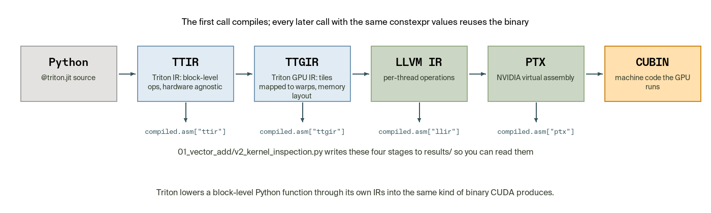

The compiled kernel object exposes every stage as text through its `asm` dictionary. [`01_vector_add/v2_kernel_inspection.py`](./01_vector_add/v2_kernel_inspection.py) writes TTIR, TTGIR, LLVM IR, and PTX to a `results/` directory so you can read how a ten-line Python kernel becomes a few hundred lines of PTX. You will rarely need this while writing kernels, but it is the tool to reach for when a kernel is slower than expected and you want to confirm what the compiler generated.

### Anatomy of a kernel

Here is the complete vector-add kernel from [`01_vector_add/v0_basic.py`](./01_vector_add/v0_basic.py):

```python
@triton.jit
def add_kernel(x_ptr, y_ptr, output_ptr, n_elements, BLOCK_SIZE: tl.constexpr):
    pid = tl.program_id(axis=0)
    block_start = pid * BLOCK_SIZE
    offsets = block_start + tl.arange(0, BLOCK_SIZE)
    mask = offsets < n_elements

    x = tl.load(x_ptr + offsets, mask=mask)
    y = tl.load(y_ptr + offsets, mask=mask)
    tl.store(output_ptr + offsets, x + y, mask=mask)
```

Each line does one job.

- **Pointers.** `x_ptr`, `y_ptr`, and `output_ptr` are not tensors. Triton converts each PyTorch tensor you pass into a pointer to the start of its data in GPU memory. Every load and store is expressed as a base pointer plus a vector of offsets.
- **`n_elements`** is an ordinary runtime integer. Marking it `constexpr` would force a fresh compile for every distinct vector length.
- **`BLOCK_SIZE: tl.constexpr`** is a compile-time constant. The compiler knows the exact tile size when it lays out loads, stores, and address arithmetic, so the binary is specialized for it. A multiple of 32 is a good default because warps have 32 threads.
- **`tl.program_id(axis=0)`** returns this program instance's position in the launch grid. It is the only thing that distinguishes one instance from another. Grids can have up to three axes; this track uses one.
- **`offsets`** turns the program ID into the global indices this instance owns: the block's start plus the local positions `0 .. BLOCK_SIZE - 1`.
- **`mask`** marks which of those offsets fall inside the array. The last block almost always runs past the end because `n_elements` is rarely a multiple of `BLOCK_SIZE`. Passing the mask to `tl.load` and `tl.store` makes the hardware skip out-of-range lanes without a branch.
- **`tl.load`** reads a whole tile from global memory into registers, **`x + y`** runs entirely in registers, and **`tl.store`** writes the tile back. Load, compute, store is the shape of every kernel in this track.

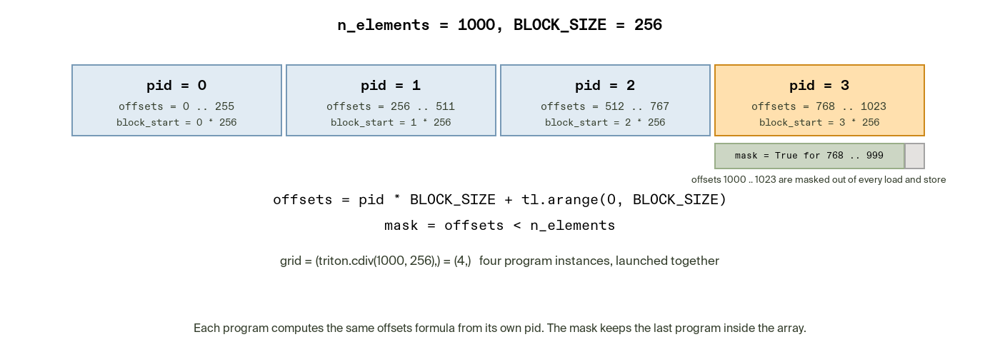

The host side is short:

```python
def add(x, y):
    output = torch.empty_like(x)
    n_elements = x.numel()
    grid = lambda meta: (triton.cdiv(n_elements, meta["BLOCK_SIZE"]),)
    add_kernel[grid](x, y, output, n_elements, BLOCK_SIZE=1024)
    return output
```

`grid` is a function that receives a dictionary of the resolved constexpr values and returns the launch shape. `triton.cdiv` is ceiling division, so 1,000,000 elements with a block size of 1024 launch 977 program instances. The kernel itself never knows how many instances exist; it only knows its own `pid`, and that separation is what lets the same kernel handle a thousand elements or a billion.

### Measuring correctly

Two rules apply to every benchmark in this track.

**Correctness before speed.** Each script calls `triton.testing.assert_close` against a PyTorch reference before it times anything. Exact equality is the wrong test for floating-point results, because the GPU can accumulate in a different order than the reference and differ in the last bits; the tolerance absorbs that. A fast kernel that computes the wrong answer has no performance to report.

**Let `do_bench` handle the clock.** Kernel launches are asynchronous, so wrapping a call in `time.time()` measures how long the CPU took to issue the launch, not how long the GPU took to run it. `triton.testing.do_bench` synchronizes the two clocks, runs warmup iterations so the first-call compilation and GPU clock ramp-up are excluded, repeats the measurement for a time budget rather than a fixed count, and flushes the L2 cache between iterations so every run reads its inputs from DRAM the way a real workload would. The scripts request the median together with the 20th and 80th percentiles so you can see the spread, not just a point. Throughput is then computed from bytes moved:

```python
gbps = lambda ms: bytes_moved * 1e-9 / (ms * 1e-3)
```

For vector addition, `bytes_moved` is three arrays of four-byte floats; for SiLU it is two. Counting bytes honestly is part of the benchmark.

## Part 4: The lessons

### 00. GPU basics

This lesson has no Triton in it. It establishes the execution model in the terms CUDA uses, so that the Triton lessons can refer back to them.

Three CUDA C++ programs under [`00_gpu_basics/cuda/`](./00_gpu_basics/cuda/), built with `make`:

- [`01_hello_kernel.cu`](./00_gpu_basics/cuda/01_hello_kernel.cu) launches one block of eight threads that each print their `threadIdx.x`. It introduces `__global__`, the `<<<blocks, threads>>>` launch syntax, and `cudaDeviceSynchronize`.
- [`02_square_array.cu`](./00_gpu_basics/cuda/02_square_array.cu) squares eight numbers with one thread each. It introduces the two memories and the five calls that move data between them: `cudaMalloc`, `cudaMemcpy` in both directions, the launch, and `cudaFree`.

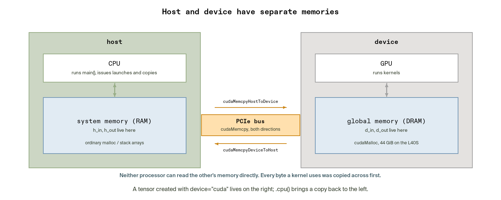

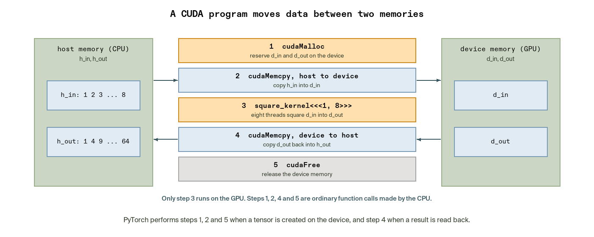

- The many-block vector addition that completes the sequence lives in [`01_vector_add/cuda/vector_add.cu`](./01_vector_add/cuda/vector_add.cu), so it sits beside the Triton kernel it mirrors. Its index formula is the one every elementwise CUDA kernel uses:

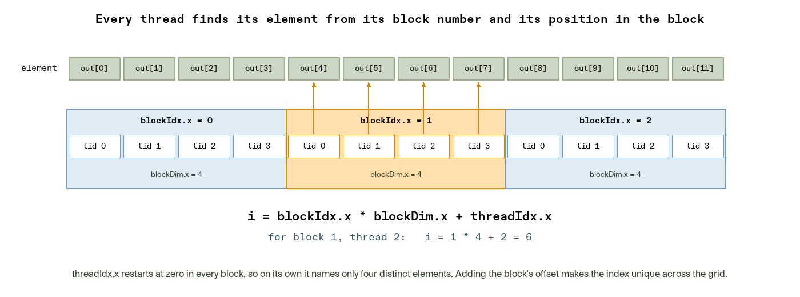


Four Python scripts show the same ideas from the PyTorch side:

- [`profile_add_relu.py`](./00_gpu_basics/profile_add_relu.py) prints the `torch.profiler` table for `(a + b).relu()`, which shows two kernels.

<picture>
  <source media="(prefers-reduced-motion: reduce)" srcset="assets/one-line-two-kernels.png">
  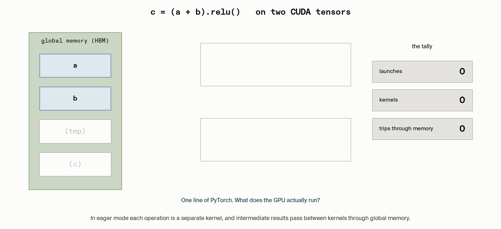
</picture>

- [`count_kernels.py`](./00_gpu_basics/count_kernels.py) counts the kernels behind the same expression in eager mode and under `torch.compile`, where it becomes one Triton kernel.
- [`async_timing.py`](./00_gpu_basics/async_timing.py) shows that wall-clock time around a launch measures the CPU, not the GPU.
- [`know_thy_gpu.py`](./00_gpu_basics/know_thy_gpu.py) prints the SM count, warp size, warp slots per SM, memory sizes, and works through how many waves a one-million-element launch takes.

### 01. Vector addition

[`v0_basic.py`](./01_vector_add/v0_basic.py) runs the kernel above at four sizes, including one that is not a multiple of the block size, and prints `OK` for each. [`v1_benchmark.py`](./01_vector_add/v1_benchmark.py) sweeps sizes from one thousand to sixteen million elements and reports GB/s against PyTorch's add. [`v2_kernel_inspection.py`](./01_vector_add/v2_kernel_inspection.py) dumps the compiler stages. [`cuda/vector_add.cu`](./01_vector_add/cuda/vector_add.cu) is the same kernel in CUDA C++, with a CPU correctness check and CUDA event timing, for comparison with the Triton version. It writes a 256 MB buffer before each timed launch to evict the inputs from L2, as `do_bench` does; without that step, sizes that fit in the L40S's 96 MiB L2 report cache bandwidth well above the DRAM ceiling.

Reference numbers from an NVIDIA L40S:

| Elements | Triton GB/s | PyTorch GB/s | CUDA C++ GB/s |
| --- | --- | --- | --- |
| 65,536 | 110 | 110 | 129 |
| 1,048,576 | 559 | 534 | 614 |
| 16,777,216 | 629 | 628 | 645 |

Small inputs cannot saturate the GPU: the fixed cost of a launch dominates and throughput is low for every implementation. Above roughly a million elements the kernel is bound by DRAM bandwidth, and a ten-line Triton kernel lands within a few percent of both the tuned kernel inside PyTorch and the hand-written CUDA C++ version, because all three are limited by the same memory system.

### 02. SiLU

SiLU, `x * sigmoid(x)`, chains a negation, an exponential, an addition, a division, and a multiplication per element, compared with vector addition's single add. It also moves less memory, one load and one store instead of two loads and one store. The benchmark shows the same GB/s ceiling as vector addition: about 620 GB/s at sixteen million elements on the L40S. The extra arithmetic is hidden entirely behind memory latency. This is the memory-bound regime in practice, and it is why the next lesson attacks bytes rather than operations.

### 03. SwiGLU and kernel fusion

SwiGLU, used in Llama, PaLM, and Mistral feed-forward layers, computes `silu(gate) * value` where `gate` and `value` are the two halves of the input. Written as two operations, PyTorch style, it launches two kernels and the intermediate `silu(gate)` travels to global memory and back between them.

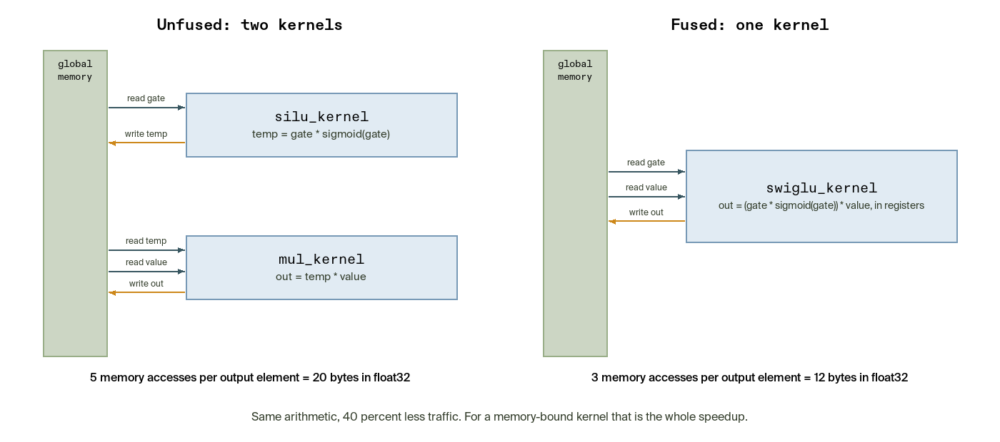

[`v0_unfused.py`](./03_swiglu_fusion/v0_unfused.py) implements exactly that: a SiLU kernel writes `temp`, a multiply kernel reads it back. Per output element the path moves five values: read `gate`, write `temp`, read `temp`, read `value`, write `out`. [`v1_fused.py`](./03_swiglu_fusion/v1_fused.py) loads `gate` and `value`, computes the activation and the product in registers, and stores once: three values. Same arithmetic, sixty percent of the traffic. [`v2_benchmark.py`](./03_swiglu_fusion/v2_benchmark.py) times both against PyTorch in milliseconds, because fewer bytes for the same output shows up directly as lower latency.

Reference numbers from an NVIDIA L40S:

| Elements | Fused ms | Unfused ms | PyTorch ms |
| --- | --- | --- | --- |
| 4,194,304 | 0.048 | 0.058 | 0.057 |
| 16,777,216 | 0.169 | 0.213 | 0.212 |
| 33,554,432 | 0.321 | 0.499 | 0.494 |

At the largest size the fused kernel is about 1.55 times faster, close to the 5:3 traffic ratio that the memory accounting predicts. PyTorch's eager mode pays the same round trip as the unfused version because each operation is its own kernel. Fusion is the reason `torch.compile` exists, and writing the fused kernel by hand is how you get it for operations the compiler does not recognize.

### 04. Masking with `tl.where`

Clamping a value to a range is a per-element conditional: `if x < lo: x = lo`. On a GPU, threads in a warp execute the same instruction together. If some threads take one branch and others take the other, the hardware runs both paths one after the other with the non-participating threads masked off. That is [warp divergence](https://docs.nvidia.com/cuda/cuda-c-best-practices-guide/index.html#branching-and-divergence), and for data-dependent conditions it can halve throughput.

`tl.where(condition, a, b)` avoids it by evaluating both candidates for every element and selecting per lane. Every thread runs the same instruction stream; the cost is that both sides are always computed, which for cheap arithmetic is far less than a divergent branch. [`v0_basic.py`](./04_masking_where/v0_basic.py) clamps with two `tl.where` calls and checks against `torch.clamp`; [`v1_benchmark.py`](./04_masking_where/v1_benchmark.py) shows it reaches the same 620 GB/s ceiling as the other elementwise kernels.

### 05. Rotary positional embedding

RoPE, used in Llama-family models to encode token position into attention queries and keys, rotates pairs of features by an angle that depends on the position `m`. In the shared-frequency layout, feature `i` pairs with feature `i + feature_dim / 2`, and both share the angle `m * omega_i`. The arithmetic is four multiplies and two adds per pair. The difficulty is entirely in addressing.

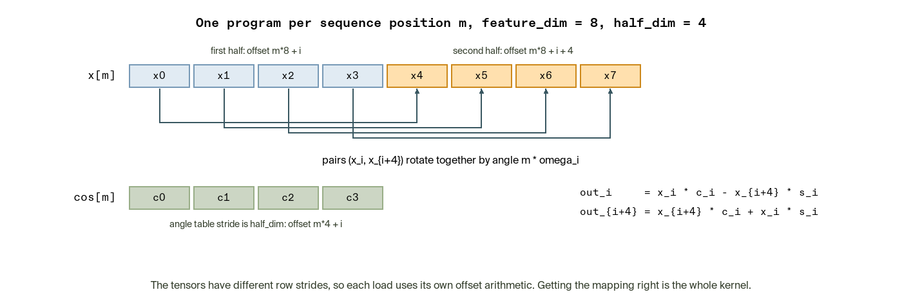

The input `x` has `feature_dim` elements per row, so program `m` reads its row starting at `m * feature_dim`. The precomputed `cos` and `sin` tables have `feature_dim / 2` elements per row, so the same program reads its angles starting at `m * feature_dim / 2`. One program handles one sequence position, loads both halves of `x` and the matching angle row with three different offset expressions, and stores both rotated halves. Getting those offsets right is the whole kernel; this is the pattern for any operation whose tensors do not share a layout. [`v1_benchmark.py`](./05_rope/v1_benchmark.py) sweeps sequence lengths at a head dimension of 128 and shows the Triton kernel at roughly 570 GB/s against about 360 GB/s for the chunk-and-cat PyTorch reference on the L40S, because the reference materializes intermediate tensors that the fused kernel never writes.

## Further reading

- [Triton documentation and tutorials](https://triton-lang.org/main/getting-started/tutorials/index.html), whose vector-add and fused-softmax tutorials are the natural next step after this track.
- *GPU Programming with Triton* by Harshwardhan Fartale (Manning, early access), which develops the execution model, memory hierarchy, and fusion material here into full chapters and continues through reductions, matrix multiplication, and attention.
- *CUDA for Deep Learning* by Elliot Arledge (Manning, early access), chapters 1 and 2, for the same concepts from the CUDA side: host and device, `threadIdx` and `blockIdx`, and the explicit memory transfers that Triton hides.
- [NVIDIA CUDA C++ Programming Guide](https://docs.nvidia.com/cuda/cuda-c-programming-guide/) and [CUDA C++ Best Practices Guide](https://docs.nvidia.com/cuda/cuda-c-best-practices-guide/), the primary references for the execution model, memory hierarchy, occupancy, and divergence described above.

[All foundations](../README.md)
